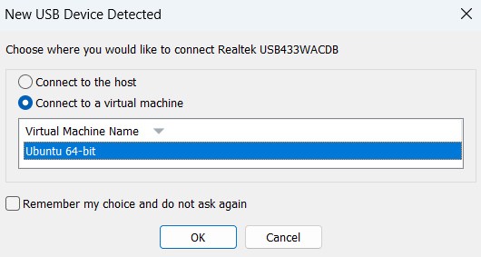

---
# Virtual Machine Setup

1) Setup a ubuntu desktop vm on your windows computer with vmware 
[vmware](https://www.techspot.com/downloads/1969-vmware-player.html)
[Ubuntu Desktop](https://ubuntu.com/download/desktop)

2) Set username to mrrdt-iarc-desk-initals 
    - (EX: mrrdt-iarc-desk-mw)

3) Set password to mrrdt

4) System Settings: 
   - Memory: 4096mb or 8192mb

   - Processor: 4-6 cpu cores


5) USB Settings:

    - Make sure USB 3.0 is enabled

    - Right click and add filter from device for the wifi adapter

6) Power up the vm and login

7) Plug in your wifi adapter 
    - (Make sure to select "Connect to virtual machine" and click the select the virtual machine from the list when you plug usb in)

    - If you forget go to VM -> Removable Devices -> Wifi Adapter and assign to VM (This step needs to be done every time vm is booted up)

8) Open the terminal

9) Run  ``` lsusb  ``` and verify that wifi adapter is there

10) Run  ``` iplink ``` and verify that wlx08beac45dcb0 (<UAIN>) is there

## BATMAN Setup

1) Use these commands to install uv
 ```
sudo apt install curl

curl -LsSf https://astral.sh/uv/install.sh | sh

sudo mv ~/.local/bin/uv /usr/local/bin/uv

sudo mv ~/.local/bin/uvx /usr/local/bin/uvx

source $HOME/.local/bin/env

uv python install 3.12
 ```

2) Create a folder for iarc and enter it
```
mkdir IARC-DEV

cd IARC-DEV
```
3) Git clone the IARC repo in

4) Go to interdrone-communication or wherever the vm-batman-setup.sh is stored

5) Run the vm-batman-setup.sh (This step needs to be done every time vm is booted up)
```
sudo bash vm-batman-setup.sh
```
## Batman should be running. Verify with 
    - `sudo batctl o`
    - `iw dev wlx08beac45dcb7 link`

## Troubleshooting:

1) VM not booting correctly

    - Make sure settings are correct as seen in setup

    - Literally just keep powercycling it (if setup is correct, this will hopefully always work)

2) VM not joining batman network correctly
    - First make sure USB Wifi Adapter is setup correctly with virtual machine
    - run sudo bash vm-batman-setup.sh

