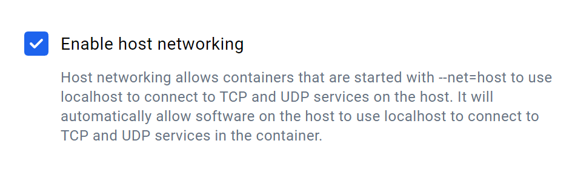

# Installing And Configuring Containers
Containers package an application and its dependencies together, ensuring consistency across different environments. This makes it easier to develop, ship, and run applications reliably on various systems. We use [Podman](https://podman.io) rather than [Docker](https://www.docker.com), but the two follow the same [Open Container Initiative](https://opencontainers.org) standards and are largely interchangeable.

## Table of Contents

It is recommended you follow this tutorial in the order listed.

- [Download Docker Desktop](#download-docker-desktop)
- [Using Windows Subsystem for Linux (WSL)](#using-windows-subsystem-for-linux-wsl)
- [Install Host Dependencies](#install-host-dependencies)
- [Getting the Containers](#getting-the-containers)
- [Running Containers (Using the Environment)](#running-containers-using-the-environment)
- [Configuring Containers](#configuring-the-containers)
- [Installing Useful Programming Tools](#installing-useful-programming-tools)

## Download Docker Desktop

* Go to this [link](https://www.docker.com/products/docker-desktop/) and download the correct docker version for your system. 
* Sign in to docker with your multirotor-associated GitHub. 
* Once signed in, go to settings → resources → network and turn on "Enable Host Networking" as shown in the image below

* Continue to the next step




## Using Windows Subsystem for Linux (WSL):

On Windows, you can install a more lightweight Linux VM using Windows
Subsystem for Linux (WSL). To install Ubuntu 24.04 using WSL, open a PowerShell instance and run the following:

```ps1
wsl --install "Ubuntu-24.04"
```

To run your virtual machine, execute `wsl` in any PowerShell/Terminal. To see more commands, you can use `wsl --help`.

If you will be using our custom Unreal-based simulation (or need to network between native Windows programs and programs running in WSL), it is easiest to use mirrored networking mode. Unfortunately, this is only compatible with WSL2, meaning that Windows 11 is required.

## Install Host Dependencies

Next, change directories to the repository (make sure to replace <competition-name> with the repo you downloaded):

```bash
cd <competition-name>
```

In the repository, we have a script to install the necessary host packages. If you do not need GPU access when coding, run the following:

```bash
./simulation/install.sh
```

If you need GPU access, run the following:

```bash
./simulation/install.sh nvidia  # if you have an nvidia GPU
# OR
./simulation/install.sh amd     # if you have an AMD GPU
```

> AMD GPUs are currently not supported (I have an Nvidia GPU, so I don't know the AMD install stuff). If you have an AMD GPU, feel free to add to the installation script and docs!

You will also need the drivers corresponding to your GPU:

- Nvidia CUDA Toolkit: <https://developer.nvidia.com/cuda-zone>
- AMD ROCm Install: <https://rocm.docs.amd.com/projects/install-on-linux/en/latest/install/quick-start.html>

This script installs `podman` and `podman-compose`, and then downloads the prebuilt container images, so the next step is usually already done for you by the time it finishes.

**You will need to restart your terminal/shell for the installation to complete.**

## Getting the Containers

To simplify (most) of environment setup, we have [containerized](https://en.wikipedia.org/wiki/Containerization_(computing)) our environment. We use a companion command called `podman-compose` (similar to `docker-compose`) that allows us to define how to run our containers in a `compose.yml` file, which lives in the `simulation/` folder.

**You do not need to build the containers.** We publish prebuilt images to the [GitHub Container Registry](https://github.com/orgs/MissouriMRR/packages), so you download them instead of compiling ArduPilot from source (which takes about 20 minutes). The packages are public, so no login is required.

`simulation/install.sh` already downloads them for you at the end of the previous step. If you skipped that, or want to re-download them later, run:

```bash
./simulation/run_container.sh pull
```

**NOTE:** You do not normally have to remember this: `run_container.sh` checks whether an image is present before starting a container, and pulls it automatically if it is missing.

### If you need to build them yourself

You only need this if you have changed `Env.Containerfile` or `Sim.Containerfile`:

```bash
./simulation/run_container.sh build
```

This may take a while, so do something else in the meantime.

## Running Containers (Using the Environment)

We have two containers: `env` and `sim`. The `env` container contains everything you need to run your code; the `sim` container will run an [ArduPilot](https://ardupilot.org) drone simulation upon startup.

> By default, the `sim` container is meant to be used with the Simulation Subteam's Unreal simulation. If you need to override this, use the `compose.override.yml` file to override the `command` property for the `sim` service to the desired command you can run ([see here](#example-overriding-the-sim-containers-start-command)). If you don't know how compose files work, you can look to `compose.yml` for reference or [read this](https://docs.docker.com/compose/).

For ease of use, we have a `run_container.sh` script in the `simulation/` folder. It can be run from any directory as it always uses the compose.yml in its directory.

Most of the time you want one container attached to your terminal. To start the `env` container and drop into a shell inside it:

```bash
./simulation/run_container.sh env
```

To start the `sim` container (which launches the ArduPilot SITL):

```bash
./simulation/run_container.sh sim
```

> Your local repository is mounted inside the `env` container at `/workspace`, so any change to your local copy is immediately reflected in the container, and vice versa. Essentially, the `env` container is a glorified virtual environment.

To detach, run the following:

```bash
exit
```

> This will also shut down the `env` container; you'll need to start it again.

To start both containers at once in the background, run the script with no arguments:

```bash
./simulation/run_container.sh
```

Because these run detached, you will not see their output. Connect to one with:

```bash
./simulation/run_container.sh attach env
```

To shutdown any running containers, do:

```bash
./simulation/run_container.sh shutdown
```

If you want to take matters into your own hands, you'll need to know how to run/use containers:

- `podman` Documentation: https://docs.podman.io/en/latest/Tutorials.html
- `podman-compose` Documentation: https://docs.podman.io/en/latest/markdown/podman-compose.1.html
- `docker` Documentation: https://docs.docker.com/build/
   - 99% of stuff that applies to Docker applies to Podman 
- `docker-compose` Documentation: https://docs.docker.com/compose/

**You have completed the docker installation and can head back to the previous instructions. Below is information about how to modify the docker containers.**

## Configuring the Containers

If you need to configure how a container is run, create a file called `compose.override.yml` in the `simulation/` folder, next to `compose.yml`. This file will allow you to override parameters set in `compose.yml` without modifying `compose.yml` itself. If you ran `simulation/install.sh` with a GPU selected, `compose.override.yml` should already exist. It is gitignored, so your local settings will not be committed.

For more information on compose files, see the following:

- `podman-compose` Documentation: https://docs.podman.io/en/latest/markdown/podman-compose.1.html
- `docker-compose` Documentation: https://docs.docker.com/compose/

##### Example: Overriding The `sim` Container's Start Command

By default, the `sim` container is configured to run the following command on startup:

```bash
python /ardupilot/Tools/autotest/sim_vehicle.py -v ArduCopter -f airsim-copter --out=127.0.0.1:14550 -A "--sim-port-in=9002 --sim-port-out=9003"
```

This is the command needed to connect to Project AirSim (the foundation of the Simulation Subteam's Unreal-based simulation). If you need to run a different command, you can use `compose.override.yml`:

```yaml
version: "3"
services:
  sim:
    command: python /ardupilot/Tools/autotest/sim_vehicle.py -v copter -L GolfCourse --map
```

This will override the `command` field for the `sim` service; essentially, whatever is in the `command` field will run upon container startup. The example above works for a non-Unreal based drone simulation.

If you already have content in `compose.override.yml`, such as enabling GPU usage, just append what you need to the file:

```yaml
version: "3"
services:
  env:
    deploy:
      resources:
        reservations:
          devices:
            - driver: nvidia
              count: all
              capabilities: [gpu]
  sim:
    command: python /ardupilot/Tools/autotest/sim_vehicle.py -v copter -L GolfCourse --map
```

The above combines the alternate `sim` command with an Nvidia GPU-enabled `env` container.

##### Example: Changing Where Your Code Is Mounted

The `env` container mounts your competition repository at `/workspace`. By default it mounts the folder that contains `simulation/`, which is correct when the simulation repo is checked out as a submodule at `<competition-repo>/simulation`. If your layout is different, set `FLIGHT_CODE_ROOT` in a `.env` file inside the `simulation/` folder:

```
FLIGHT_CODE_ROOT=../SUAS-2026
```

`podman-compose` loads `.env` automatically. Like `compose.override.yml`, it is gitignored.

## Installing Useful Programming Tools

#### Visual Studio Code

Visual Studio Code (VS Code) is a popular code editor with numerous free extensions you
can download to add features and customizations; however, if you wish to use a different IDE/text editor, feel free to do so.

If you are using WSL, VS Code might already be installed. You can check if VS Code is installed by seeing if the following command has any output:

```bash
which code
```

If VS Code is not installed, you can run the following command to install VS Code:

```bash
sudo snap install --classic code
```

Then, to open VS Code, simply run the following command in the directory you want to edit
code in:

```bash
code .
```