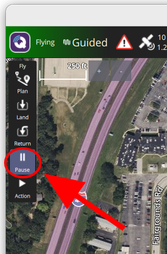
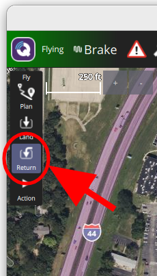
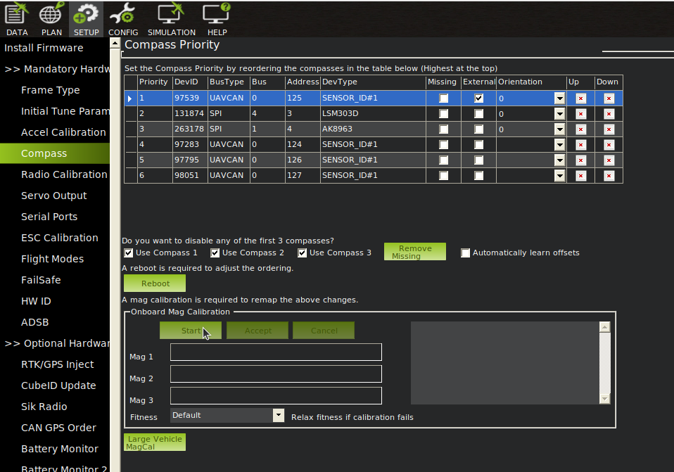

# Flight Testing

### Introduction
This documentation will go over all you need to know for running code on all of our drones, going from packing up all the stuff you need from the bay to a connection to the drone outside.

## Step 1: Pack Everything You Need

For testing you will need the following items:
* Ground Station
    * This doesn't have to be the actual full ground station if you don't feel like bringing it out, this can be someone's laptop. All it needs is the code you want to run and QGroundControl/MissionPlanner.
* Drone
* Router
    * This actually depends on if the drone has an onboard computer or not. If yes, you will need a router. We use the router to connect on the same network as the drone to SSH into the computer and remotely run the code.
* Telemetry Receivers/Radios
    * Used for telemetry from the drone to the ground station. This is how we get the data from the drone to the ground station.
* Portable Battery OR Generator
    * Used to power everything on the ground. If testing for more than 1-2 hours a generator will be needed.

Before you leave the bay, do a connection test to the drone to make sure there isn't anything wrong with the telemetry. If you are using  No one wants to sit outside trying to debug connection. You can do this by using the connection_test.py files in the SUAS repos in `flight/test_files/`.

## Step 2: Setup the Ground Station
Once you bring everything outside and open everything up, it's time to setup everything you will need.

Log into the ground station. Need the password? Ask one of the leads.

First, if you are using a router, connect the ground station to the drone. Type `192.168.0.1` into a web browser to open the router webportal and see if the onboard computer is connected (with our current router you can go to the DHCP clients list to check this). If the onboard computer doesn't connect directly see the tips section. Then open up a SSH session to the computer.

Next, open QGroundControl/MissionPlanner. This is where you will be able to see the drone's telemetry and take over the drone "manually" if the code does something wrong. A lesson I learned from previous flight days: if the drone is going somewhere it shouldn't be, killing the code and commanding QGC/MissionPlanner to hold instead of a manual takeover will be 10x safer for the drone if it isn't in immediate danger. Learn how to use QGC/MissionPlanner to return to launch and land.




Lastly, check all of the flight parameters that are in the code. Make sure all waypoints are where they should be, the altitude isn't set to anything crazy, and that you know what units the data is in. Currently all the waypoint data use altitude in meters relative to launch position. Don't fly all the way to Maryland!

## Step 3: Run Tests
We have a few tests before we test our code to make sure the drone is acting as it should be.

We start with a quick manual flight. Have the safety pilot take off, fly around for a bit, hold in the air for 10-15 seconds, then land again.

Next, run a connection test to the drone, just to check that you are able to establish a stable connection to the drone again.

You also want to run any unit tests for any external components that are on the drone. Like running the camera test to check the camera, or a servo test for the servos. Just to check all connections from the computer or the flight controller to any "external" devices.

If you notice any inconsistencies with how the drone is flying, consider doing "the dance". This is a calibration routine that can be started either through QGroundControl or MissionPlanner.

In ArduPilot & MissionPlanner you should just have to rotate it around a lot to calibrate it.

## Step 4: Run the Code

Now that you have done all the pre-flight tests and checks, you can finally run the code. Make sure to log any flights in the EHS binder.

To run a specific file within the repo from the base folder:
```bash
# To run flight/test_files/connection_test.py
python -m flight.test_files.connection_test
```

## Tips
### Connection Strings
```bash
# Connect to simulator (ardupilot)
tcp:127.0.0.1:5762

# Connect to physical drone using telemetry radio
# First, find the serial device
ls /dev/ttyUSB*
ls /dev/ttyACM*
# The address will be something like /dev/ttyUSB0 or /dev/ttyACM0

# Then, use mavproxy to split the connection between code & QGround/MissionPlanner
mavproxy.py --master=/dev/ttyUSB0 --out 127.0.0.1:14550 --out 127.0.0.1:14446
# Port 14446 is used for the code
# Port 14550 is used for QGC/MissionPlanner (QGC should auto connect)
```

### SSH over USB
While testing Maverick there would be a lot of times where the TX2 computer would not autoconnect to the router's network. Instead of bringing out a monitor and using a GUI to fix it, SSHing over USB using minicom saves a lot of time.
```bash
# Install minicom
sudo apt install minicom

# Find USB path
ls /dev/ttyUSB*
ls /dev/ttyACM*
# The address will be something like /dev/ttyUSB0 or /dev/ttyACM0

# Run minicom
minicom -D /dev/ttyUSB0
# Now you will have an emulated terminal to the onboard computer
```

## Troubleshooting
### Connection Troubles
List of things to try if you can't connect to the onboard computer:
* Try different baudrates/ip addrs
* Make sure address in code is correct (and has correct baudrate if needed)
* Use mavproxy/mavsdk_server to attempt connections to get more error details
    * mavsdk_server is a executable that is included in the MAVSDK library for Python. You can find it under (local library path)/mavsdk/bin/mavsdk_server, local library path is usually ~/.local/lib/python3.10/site-packages/
