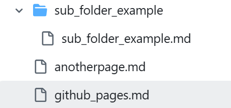

# Markdown and Navigation Basics for GitHub Pages

GitHub Pages uses the **jekyll-commonmark** Markdown engine, supporting headings, lists, links, tables, code blocks, and more. 

This page explains:
- The essential Markdown syntax you’ll use on GitHub Pages  
- How to use permalinks in the Jekyll Markdown engine
- How to link between pages using relative paths  
- How to link within a page using heading anchors  

## Markdown Essentials

### Headings
Headings are created using one to six `#` symbols. GitHub automatically assigns IDs to headings, enabling internal page links.

# H1 Title `#H1 Title`
## H2 Section `## H2 Section`
### H3 Subsection `### H2 Section`


### Styling Text
Standard Markdown formatting, such as bold, italic, and combined emphasis.

**Bold text:** `**Bold text:**`

*Italic text* `*Italic text*`

***Bold and italic*** `***Bold and italic***`

### Lists
Ordered and unordered lists:

- Item 1 `- Item 1`
- Item 2

1. First `1. First`
2. Second

### Links

#### Standard hyperlink
[https://github.com](https://github.com)

#### Linking to a section on the same page
[To Links Section Header](#Headings) `[To Links Section Header](#Headings)`

### Code Blocks
Inline: `git status` \`git status\`

Fenced:
(Use \`\`\`)
```
git add .
git commit -m "Message"
```

## Navigating Between Pages in Your Repository

### Linking to Another Page in the Same Folder
[Another Page](anotherpage.md) `(Another Page)[anotherpage.md]`

### Linking to a Page in a Subfolder
[Sub Folder](sub_folder_example/sub_folder_example.md) `(Sub Folder)[sub_folder_example/sub_folder_example.md]`

### Linking to a Parent Directory
../index.md

### Linking with Absolute Paths
(Base directory is always /docs/ ...)

/docs/contact.md

Setting the page permalink by including the following at the top of the page allows you to access the page as if it is in the base directory
```
---
layout: default
permalink: /github_pages/
---
```
See this page for an example:

[Github Pages](/docs/github_pages/) `[Github Pages](/docs/github_pages/)`

### Linking to Images (Also the File Organization Used for Examples)
``




